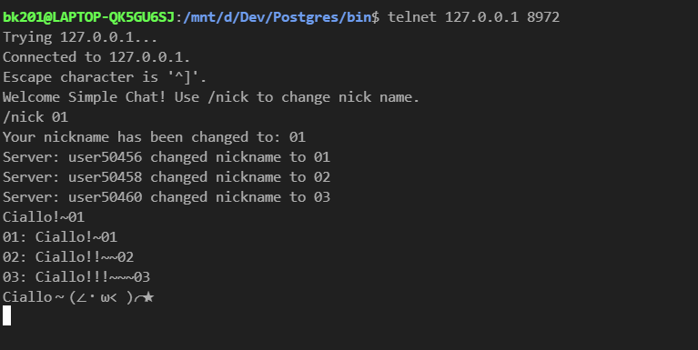
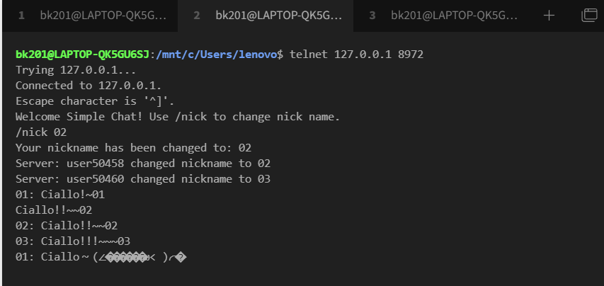
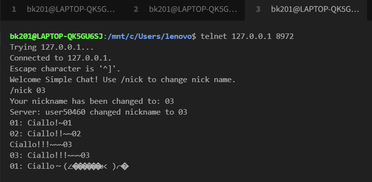

# smallchat
A minimal programming example for a chat server in Java.







This application was generated using http://start.vertx.io

## Building

To launch your tests:
```
./mvnw clean test
```

To package your application:
```
./mvnw clean package
```

To run your application:
```
./mvnw clean compile exec:java
```

## TODO
- [ ] 乱码问题
